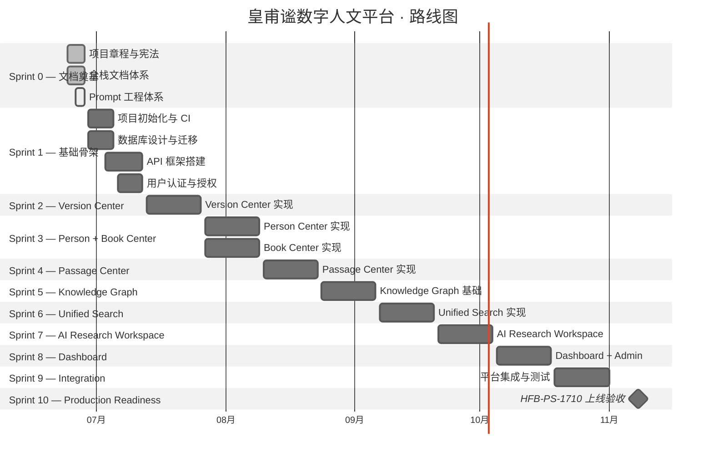

# Product Roadmap — 产品路线图

> 本文档为产品路线图概览。详细产品规格以 **17-Platform-Specifications** 为准。
>
> **MVP 边界见 HFB-PS-1709，上线准入标准见 HFB-PS-1710。**

---

> **版本:** v0.2.0
> **状态:** Draft
> **适用范围:** 产品 · 技术 · 设计
> **维护者:** 产品负责人

## 1. 产品最高依据

本路线图受以下治理文档约束：

| 依据                                                                                             | document_id  | 作用                        |
| ------------------------------------------------------------------------------------------------ | ------------ | --------------------------- |
| [MVP Implementation](../17-Platform-Specifications/1709_MVP_Implementation_Specification.md)     | HFB-PS-1709  | MVP 边界 — 做什么、不做什么 |
| [Production Readiness](../17-Platform-Specifications/1710_Production_Readiness_Specification.md) | HFB-PS-1710  | 上线准入标准                |
| [Project Charter](../00-governance/0001-project-charter.md)                                      | HFB-GOV-0001 | 使命、愿景、范围            |
| [Technical Blueprint](../02-architecture/0201_Technical_Blueprint.md)                            | HFB-ARC-0201 | 技术架构                    |

## 2. MVP Sprint 规划

以 HFB-PS-1709 为边界，MVP 建设 11 个模块：

- 用户与权限
- Version Center
- Passage Center
- Person Center
- Book Center
- Knowledge Graph
- Unified Search
- AI Research Workspace
- Research Workspace
- Dashboard
- System Management

**GraphRAG 不属于 MVP。** Neo4j、Milvus、GraphRAG 仅在 Roadmap 对应 Sprint 引入，MVP 阶段仅预留接口。

## 3. MVP 非建设范围

第一阶段不建设（详见 HFB-PS-1709 第四章）：

- APP、微信小程序
- VR/AR 展示、数字博物馆
- 自动论文生成、多 Agent 自主科研
- 大规模数据开放接口

## 4. 路线图总览

## 5. 上线准入

**上线以 HFB-PS-1710 为准入标准。** 任何未满足 HFB-PS-1710 全部 Go-Live Criteria 的版本，不得进入生产环境。

---

> **创建日期:** 2026-06-24
> **最后更新:** 2026-06-25
