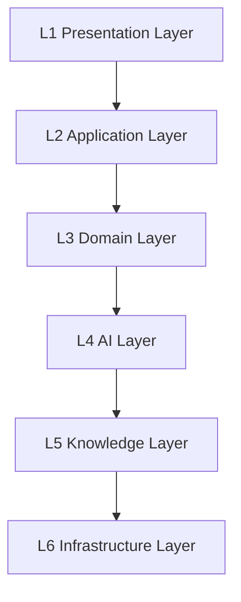

# Technical Blueprint
## 技术白皮书

> 本文档定义本项目唯一认可的技术架构。
>
> 所有开发工作必须以本技术白皮书为依据。
>
> 产品规格最高依据为 [17-Platform-Specifications](../17-Platform-Specifications/)。
>
> 如实现与本文档或 17 系列发生冲突，必须先完成 Architecture Alignment，不得继续开发。

---

## 目录

- [第一章 技术目标](#第一章-技术目标)
- [第二章 总体架构](#第二章-总体架构)
- [第三章 六层架构说明](#第三章-六层架构说明)
- [第四章 Monorepo 架构](#第四章-monorepo-架构)
- [第五章 技术选型](#第五章-技术选型)
- [第六章 开发架构](#第六章-开发架构)
- [第七章 API 规范](#第七章-api-规范)
- [第八章 数据访问规范](#第八章-数据访问规范)
- [第九章 领域模型](#第九章-领域模型)
- [第十章 AI 架构规划](#第十章-ai-架构规划)
- [第十一章 非功能需求](#第十一章-非功能需求)
- [第十二章 安全要求](#第十二章-安全要求)
- [第十三章 架构红线](#第十三章-架构红线)
- [第十四章 技术演进路线](#第十四章-技术演进路线)
- [第十五章 技术决策原则](#第十五章-技术决策原则)
- [第十六章 MVP 与上线约束](#第十六章-mvp-与上线约束)

---

# 第一章 技术目标

平台必须满足以下目标：

- 可持续开发（Sustainable Development）
- AI 原生（AI Native）
- 数字人文（Digital Humanities）
- 高可维护（Maintainable）
- 高可扩展（Extensible）
- 高可追溯（Traceable）

所有技术选型与架构设计必须服务于 [17-Platform-Specifications](../17-Platform-Specifications/) 定义的产品能力。

---

# 第二章 总体架构

采用六层架构，自下而上：



架构原则：

- 上层依赖下层，下层不感知上层
- 每层通过明确定义的接口通信
- 禁止跨层直接访问（如 Controller 直接访问数据库）
- 参见 [HFB-PS-1708 Platform Integration Specification](../17-Platform-Specifications/1708_Platform_Integration_Specification.md)

---

# 第三章 六层架构说明

## L1 Presentation Layer

负责：

- Web Portal
- Admin Portal
- AI Assistant
- Visualization
- Mobile Ready

技术：

- Vue3
- TypeScript
- Vite
- Pinia
- Vue Router

产品依据：[HFB-PS-1702 Platform Information Architecture](../17-Platform-Specifications/1702_Platform_Information_Architecture_Specification.md)

---

## L2 Application Layer

负责：

- REST API
- Authentication
- Authorization
- Workflow
- Business Orchestration

技术：

- FastAPI

产品依据：[HFB-PS-1708 Platform Integration](../17-Platform-Specifications/1708_Platform_Integration_Specification.md)

---

## L3 Domain Layer

负责：

领域模型。

采用：

DDD（Domain Driven Design）。

不得：

业务逻辑进入 Controller。

---

## L4 AI Layer

负责：

AI 能力建设。

包括：

- RAG
- GraphRAG
- Prompt
- Citation
- Evidence
- Retrieval

注意：

本层按 Roadmap 分阶段建设。MVP 阶段 AI 能力以 [HFB-PS-1705 AI Research Workspace](../17-Platform-Specifications/1705_AI_Research_Workspace_Specification.md) 和 [HFB-PS-1709 MVP](../17-Platform-Specifications/1709_MVP_Implementation_Specification.md) 第六章为边界。

AI 工程标准见 [HFB-AI-0401 AI Engineering Standard](../04-ai/0401_AI_Engineering_Standard.md)。

---

## L5 Knowledge Layer

负责：

知识组织。

包括：

- Ontology
- Entity
- Relation
- Metadata
- Knowledge Package

数据标准见 [HFB-DAT-0301 Data Standard Specification](../03-data/0301_Data_Standard_Specification.md)。

---

## L6 Infrastructure Layer

负责：

基础设施。

包括：

- PostgreSQL
- Redis
- Elasticsearch
- MinIO
- Docker
- CI/CD

---

# 第四章 Monorepo 架构

统一目录：

```text
apps/
    backend/
    frontend/

packages/
    config/
    types/
    ui/
    utils/

docs/

docker/

tests/

scripts/
```

任何模块不得脱离 Monorepo。

---

# 第五章 技术选型

| 模块 | 技术 | 决策依据 |
|------|------|----------|
| Backend | FastAPI | [ADR-0001](../11-adr/ADR-0001-FastAPI.md) |
| Frontend | Vue3 | [ADR-0002](../11-adr/ADR-0002-Vue3.md) |
| Database | PostgreSQL | [ADR-0003](../11-adr/ADR-0003-PostgreSQL.md) |
| Cache | Redis | — |
| Search | Elasticsearch | [ADR-0005](../11-adr/ADR-0005-Elasticsearch.md) |
| Object Storage | MinIO | — |
| Migration | Alembic | — |
| Container | Docker Compose | [ADR-0008](../11-adr/ADR-0008-Docker.md) |
| Package Manager | pnpm | — |

以下技术属于后续阶段，**不属于 MVP**：

| 技术 | 决策依据 | 引入阶段 |
|------|----------|----------|
| Neo4j | [ADR-0004](../11-adr/ADR-0004-Neo4j.md) | Post-MVP |
| GraphRAG | [ADR-0006](../11-adr/ADR-0006-GraphRAG.md) | Post-MVP |
| Milvus | [ADR-0007](../11-adr/ADR-0007-Milvus.md) | Post-MVP |

MVP 阶段不得引入上述技术。

---

# 第六章 开发架构

Backend：

```text
api/
core/
db/
models/
schemas/
repositories/
services/
middleware/
utils/
```

Controller 只负责：

请求。

业务逻辑：

全部进入 Service。

数据库访问：

全部进入 Repository。

开发标准见 [HFB-DEV-0501 Development Specification](../05-development/0501_Development_Specification.md)。

---

# 第七章 API 规范

统一：

RESTful。

统一返回：

```json
{
  "success": true,
  "timestamp": "...",
  "data": {},
  "message": ""
}
```

错误：

统一异常处理中间件。

不得：

Controller 中直接返回复杂错误。

API 设计标准见 [HFB-DEV-0504 API Design Standard](../05-development/0504_API_Design_Standard.md)。

---

# 第八章 数据访问规范

数据库：

SQLAlchemy 2.0。

Repository Pattern。

禁止：

Controller 直接访问数据库。

禁止：

Service 直接写 SQL。

数据库开发标准见 [HFB-DEV-0505 Database Development Standard](../05-development/0505_Database_Development_Standard.md)。

---

# 第九章 领域模型

## 9.1 MVP 阶段领域模型

当前 Sprint 允许存在：

- Document
- Person
- Book
- Version
- Chapter
- Passage
- Paper
- Image
- User（权限阶段）

## 9.2 禁止提前加入的模型

- Herb
- Prescription
- Disease
- Symptom
- Meridian
- Formula
- Acupoint

上述模型将在未来扩展阶段讨论。以 [HFB-PS-1709 MVP](../17-Platform-Specifications/1709_MVP_Implementation_Specification.md) 第五章数据范围为边界。

---

# 第十章 AI 架构规划

AI 分四阶段实施，不跳阶段：

| Phase | 内容 | 对应 Roadmap | 状态 |
|---|---|---|---|
| Phase 1 | AI 接口预留 | MVP | 当前 |
| Phase 2 | RAG | Post-MVP | 排队 |
| Phase 3 | GraphRAG | Post-MVP | 排队 |
| Phase 4 | Research Agent | Post-MVP | 排队 |

任何阶段不得提前开发下一阶段能力。

AI 架构详细规范见 [HFB-AI-0401](../04-ai/0401_AI_Engineering_Standard.md)、[HFB-AI-0402 RAG](../04-ai/0402_RAG_Specification.md)、[HFB-AI-0403 GraphRAG](../04-ai/0403_GraphRAG_Specification.md)。

---

# 第十一章 非功能需求

平台必须满足：

可用性：

≥99.9%

测试覆盖率：

Backend ≥90%

Frontend ≥80%

API：

OpenAPI 自动生成。

CI：

全部通过。

上线性能标准见 [HFB-PS-1710 Production Readiness](../17-Platform-Specifications/1710_Production_Readiness_Specification.md) 第十二章。

---

# 第十二章 安全要求

统一：

- JWT
- RBAC
- 输入校验
- SQL 注入防护
- XSS 防护
- CSRF 防护
- Prompt Injection 防护
- 审计日志
- 敏感配置环境变量管理

上线安全标准见 [HFB-PS-1710 Production Readiness](../17-Platform-Specifications/1710_Production_Readiness_Specification.md) 第十三章。

安全开发标准见 [HFB-SEC-0702 Security Standard](../07-security/0702_Security_Standard.md)。

---

# 第十三章 架构红线

以下行为禁止：

- 跳 Sprint 开发；
- 引入未批准技术；
- 绕过 Repository；
- 绕过 Service；
- Controller 编写业务逻辑；
- 无文档先开发；
- 未经 ADR 引入核心组件；
- **超出 MVP 范围开发**（参见 [HFB-PS-1709](../17-Platform-Specifications/1709_MVP_Implementation_Specification.md)）；
- **将未满足上线标准的代码标记为 Production Ready**（参见 [HFB-PS-1710](../17-Platform-Specifications/1710_Production_Readiness_Specification.md)）。

任何 AI（Claude Code、ChatGPT、Codex、Gemini）均受以上红线约束。职责边界参见 [HFB-GOV-0005 AI Execution Protocol](../00-governance/0005_AI_Execution_Protocol.md)。

---

# 第十四章 技术演进路线

Sprint 0：

治理与文档奠基。

Sprint 1：

基础设施与 Monorepo 搭建。

Sprint 2：

RBAC 与用户体系。

Sprint 3：

Version Center。

Sprint 4：

Person Center。

Sprint 5：

Book Center。

Sprint 6：

Passage Center。

Sprint 7：

Knowledge Graph 基础。

Sprint 8：

Unified Search。

Sprint 9：

AI Research Workspace。

Sprint 10：

Dashboard 与 System Management。

Sprint 11+：

GraphRAG、Research Agent 等后续能力。

MVP 范围为 Sprint 1–10。具体 Sprint 范围以各 Sprint Context 文档和 [HFB-PS-1709](../17-Platform-Specifications/1709_MVP_Implementation_Specification.md) 为准。

---

# 第十五章 技术决策原则

所有重大技术决策必须：

1. 建立 ADR （[docs/11-adr/](../11-adr/)）；
2. 更新本 Blueprint；
3. 经 Chief Product & Technical Architect 批准。

未经批准不得实施。

---

# 第十六章 MVP 与上线约束

## 16.1 MVP 开发边界

本文档明确：**MVP 开发以 [HFB-PS-1709](../17-Platform-Specifications/1709_MVP_Implementation_Specification.md) 为边界。**

- 所有 MVP 阶段技术选型不得超过 HFB-PS-1709 定义的模块范围
- Neo4j、Milvus、GraphRAG 属于 Post-MVP 技术，MVP 阶段仅预留接口
- MVP 阶段禁止开发超出 HFB-PS-1709 范围的领域模型

## 16.2 上线技术标准

本文档明确：**上线以 [HFB-PS-1710](../17-Platform-Specifications/1710_Production_Readiness_Specification.md) 为准入标准。**

- 所有性能、安全、测试、数据质量要求以 HFB-PS-1710 为准
- 架构必须通过 Codex 安全审计
- UI 必须通过 Gemini 学术 UX 审查
- 未经 Chief Product & Technical Architect 批准，不得上线

---

# 修订记录

| Version | Date | Description |
|----------|------|-------------|
| 1.1.0 | 2026-06-25 | 新增第十六章(MVP与上线约束)；补充各章对17系列的交叉引用；更新related_documents；更新技术演进路线对齐MVP范围；补充AI架构规划的阶段表格；补充架构红线中的MVP和上线约束 |
| 1.0.0 | 2026-06-24 | 首版发布，作为项目唯一技术架构规范。 |
