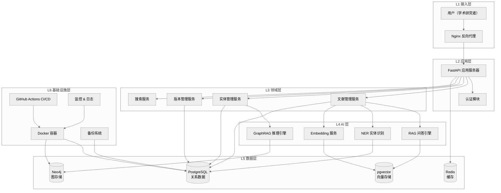

# 00 System Architecture — 六层系统架构图

---

> **版本:** V0.1
> **状态:** Draft
> **适用范围:** 技术团队
> **维护者:** 技术负责人

## 1. 六层架构总览



## 2. 层级职责

| 层 | 名称 | 职责 | 对外接口 | 依赖 |
|---|---|---|---|---|
| L1 | 接入层 | HTTPS 终止、路由、限流、静态资源 | 80/443 | — |
| L2 | 应用层 | REST API、请求验证、认证授权 | `/api/v1/*` | L1 |
| L3 | 领域层 | 业务逻辑、领域规则、数据转换 | Python 模块 | L5 |
| L4 | AI 层 | RAG、GraphRAG、NER、Embedding | Python 模块 | L3, L5 |
| L5 | 数据层 | 持久化、查询、缓存 | 5432/7687/7474/6379 | L6 |
| L6 | 基础设施层 | 部署、CI/CD、监控、备份 | — | — |

## 3. 关键数据流

### RAG 问答流

```
用户提问 → L2(API) → L4(RAG) → L5(pgvector检索) → L4(LLM生成) → L2 → 用户
```

### 实体关系推理流

```
用户提问 → L2(API) → L4(GraphRAG) → L5(Neo4j子图) → L4(LLM推理) → L2 → 用户
```

### 文献导入流

```
管理员 → L2(API) → L3(文献服务) → L5(PostgreSQL) → L4(Embedding) → L5(pgvector)
```

---

> **创建日期:** 2026-06-24
> **最后更新:** 2026-06-24
