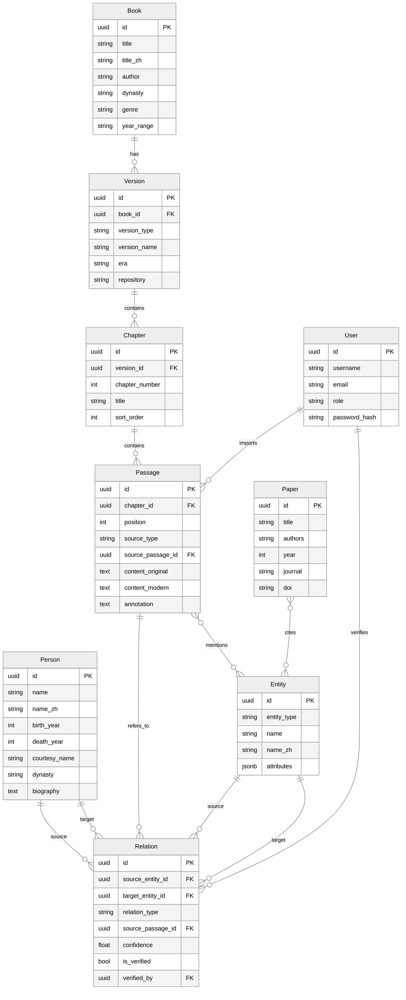

# 01 Database ER — 核心数据库 ER 图

---

> **版本:** V0.1
> **状态:** Draft
> **适用范围:** 后端 · 数据 · AI
> **维护者:** 技术负责人

## 1. 核心 ER 图

## 2. 实体说明

| 实体 | 表名 | 说明 | 关键字段 |
|---|---|---|---|
| Person | `persons` | 历史/现代人物 | name, name_zh, birth_year, death_year, dynasty |
| Book | `books` | 古籍 | title, author, dynasty, genre |
| Version | `versions` | 书籍版本（底本/校本/注本） | version_type, version_name, era |
| Chapter | `chapters` | 版本内的章节 | chapter_number, title |
| Passage | `passages` | 最小文本单元 | content_original, content_modern, annotation |
| Paper | `papers` | 现代研究论文 | title, authors, year, doi |
| Entity | `entities` | 通用实体基表 | entity_type, name, attributes(JSONB) |
| Relation | `relations` | 实体间关系 | relation_type, confidence, is_verified |
| User | `users` | 学术用户 | username, email, role |

## 3. 关系说明

| 源 | 目标 | 关系类型 | 说明 |
|---|---|---|---|
| Book | Version | 1:N | 一部书有多个版本 |
| Version | Chapter | 1:N | 一个版本有多个章节 |
| Chapter | Passage | 1:N | 一个章节有多个段落 |
| Passage | Relation | 1:N | 关系可追溯到出处段落 |
| Entity | Relation | 1:N（源） | 一个实体作为关系起点 |
| Entity | Relation | 1:N（目标） | 一个实体作为关系终点 |
| Passage | Entity | M:N | 段落与实体间的提及关系 |
| User | Passage | 1:N | 记录导入者 |
| User | Relation | 1:N | 记录验证者 |
| Paper | Entity | M:N | 论文与实体的引用关系 |

## 4. 设计要点

- **Entity 是基表**：Person 继承 Entity，共享 id 空间。通过 `entity_type` 字段区分具体类型，通过 `attributes` JSONB 存储类型特有属性
- **Passage 是最小单元**：所有文本内容以 Passage 为单位存储，NLP 和 AI 处理在 Passage 粒度进行
- **Relation 可溯源**：每条 Relation 关联到一个 Passage，确保 AI 抽取的关系可以追溯到原文出处
- **Version 是核心抽象**：同一书籍的不同版本是独立的 Version 记录，通过 `version_type` 区分底本/校本/注本

---

> **创建日期:** 2026-06-24
> **最后更新:** 2026-06-24
