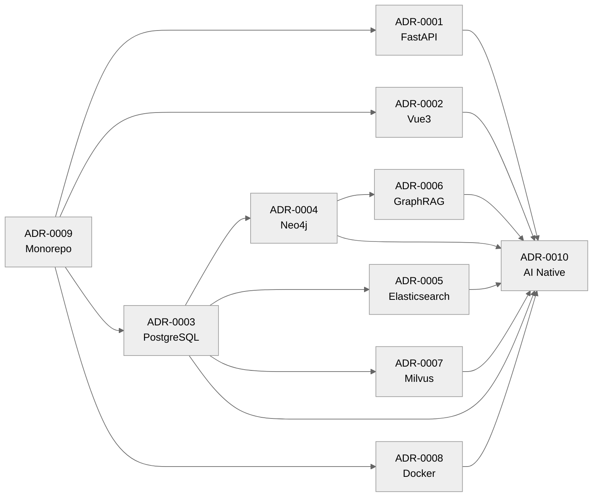

# 11 ADR — Architecture Decision Records

皇甫谧数字人文平台全部架构决策的完整记录。ADR 不可变，只能被新 ADR 取代，不得修改。

---

> **版本:** 1.1
> **状态:** Active
> **适用范围:** 全项目 · 技术决策
> **维护者:** Chief Software Architect

## 目录

- [1. ADR 列表](#1-adr-列表)
- [2. ADR 依赖图](#2-adr-依赖图)
- [3. ADR 状态说明](#3-adr-状态说明)
- [4. ADR 模板](#4-adr-模板)
- [5. ADR 流程](#5-adr-流程)
- [6. MVP 与 ADR](#6-mvp-与-adr)

## 1. ADR 列表

| #    | ADR                                        | 决策                            | 状态     | MVP         |
| ---- | ------------------------------------------ | ------------------------------- | -------- | ----------- |
| 0001 | [FastAPI](ADR-0001-FastAPI.md)             | 选择 FastAPI 作为 API 框架      | Accepted | ✅          |
| 0002 | [Vue3](ADR-0002-Vue3.md)                   | 选择 Vue 3 作为前端框架         | Accepted | ✅          |
| 0003 | [PostgreSQL](ADR-0003-PostgreSQL.md)       | 选择 PostgreSQL 作为主数据库    | Accepted | ✅          |
| 0004 | [Neo4j](ADR-0004-Neo4j.md)                 | 选择 Neo4j 作为图数据库         | Accepted | ❌ Post-MVP |
| 0005 | [Elasticsearch](ADR-0005-Elasticsearch.md) | 选择 Elasticsearch 作为搜索引擎 | Accepted | ✅          |
| 0006 | [GraphRAG](ADR-0006-GraphRAG.md)           | 选择 GraphRAG 图推理架构        | Accepted | ❌ Post-MVP |
| 0007 | [Milvus](ADR-0007-Milvus.md)               | 选择 Milvus 作为向量数据库      | Accepted | ❌ Post-MVP |
| 0008 | [Docker](ADR-0008-Docker.md)               | 选择 Docker 作为部署方案        | Accepted | ✅          |
| 0009 | [Monorepo](ADR-0009-Monorepo.md)           | 选择 Monorepo 代码组织          | Accepted | ✅          |
| 0010 | [AI Native](ADR-0010-AI-Native.md)         | 建立 AI Native 文档体系         | Accepted | ✅          |

## 2. ADR 依赖图



## 3. ADR 状态说明

| 状态       | 说明                      |
| ---------- | ------------------------- |
| Proposed   | 提案中，待决策            |
| Accepted   | 已接受，当前生效          |
| Superseded | 被新的 ADR 取代，不再执行 |
| Deprecated | 已废弃，但历史保留        |

## 4. ADR 模板

所有 ADR 包含七个章节：

1. **Status** — 当前状态
2. **Context** — 决策背景和问题
3. **Decision** — 决策内容
4. **Alternatives** — 候选方案及对比
5. **Consequences** — 正面和负面影响
6. **Future** — 未来演化方向
7. **References** — 相关文档

## 5. ADR 流程

```
识别决策需求 → 提出 ADR (Proposed) → 团队评审 → Accepted / Rejected
Accepted → 执行 → 如需变更 → 新 ADR 取代旧 ADR (Superseded)
```

## 6. MVP 与 ADR

依据 [HFB-PS-1709 MVP](../17-Platform-Specifications/1709_MVP_Implementation_Specification.md)：

- **MVP 阶段生效**（7 项）：ADR-0001/0002/0003/0005/0008/0009/0010
- **Post-MVP 阶段生效**（3 项）：ADR-0004 (Neo4j)、ADR-0006 (GraphRAG)、ADR-0007 (Milvus)
- Post-MVP ADR 仅作架构预留，**MVP 阶段不实施相关技术**

---

> **创建日期:** 2026-06-24
> **最后更新:** 2026-06-25
