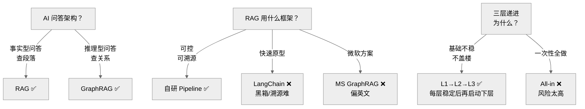

# Decision Tree — AI

为什么选择自研 Pipeline 而非现成框架。

---

## 决策路径

1. 两种问答需求（事实型 vs 推理型）→ 两条路径
2. 现成框架不可溯源 → 自研 Pipeline
3. 分层递进降低风险 → L1(RAG) 稳定后启动 L2(GraphRAG)
4. 古籍领域特殊 → 需要自训练的 NER 模型

## 相关 ADR

- ADR-0006 GraphRAG
- ADR-0007 Milvus

---

> **创建日期:** 2026-06-24
> **最后更新:** 2026-06-24
