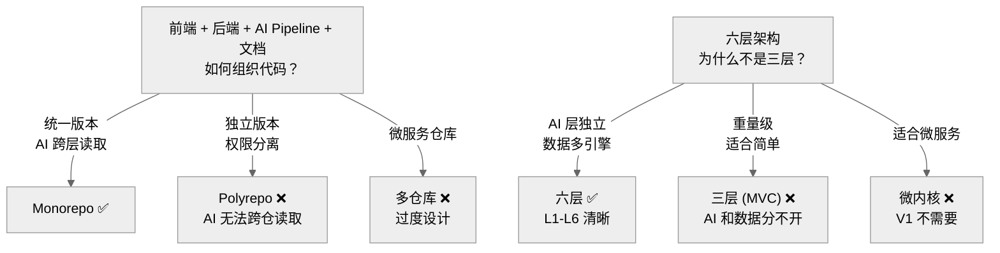

# Decision Tree — Architecture

为什么选择六层架构 + Monorepo。

---

## 决策路径

1. 项目包含 4 个独立模块（前后端+AI+文档）→ Monorepo 是最优解
2. AI 层和数据层需要独立扩展 → 六层架构提供了清晰的边界
3. 六层不是一开始就全部构建 — V1 重点是 L2/L3/L5

## 相关 ADR

- ADR-0001 FastAPI
- ADR-0009 Monorepo

---

> **创建日期:** 2026-06-24
> **最后更新:** 2026-06-24
