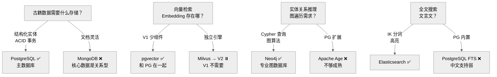

# Decision Tree — Database

为什么需要四个数据库，而不是一个。

---

## 决策路径

1. 主数据库必须是关系型 → PostgreSQL（ACID + JSONB + pgvector）
2. 向量存储 V1 不引入新组件 → pgvector
3. 图查询需求明确 → Neo4j（Cypher 直观 + 图算法）
4. 中文全文搜索 PG 不够 → Elasticsearch + IK 分词

## 相关 ADR

- ADR-0003 PostgreSQL
- ADR-0004 Neo4j
- ADR-0005 Elasticsearch
- ADR-0007 Milvus

---

> **创建日期:** 2026-06-24
> **最后更新:** 2026-06-24
