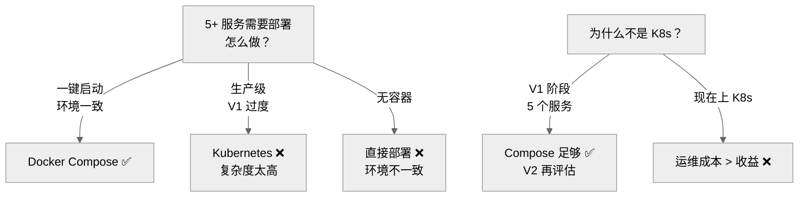

# Decision Tree — Deployment

为什么选择 Docker Compose 而不是 K8s 或直接部署。

---

## 决策路径

1. V1 阶段 5+ 服务：Docker Compose 一键启动 → 新成员 15 分钟上手
2. K8s 运维成本远高于当前需求 → V2 阶段再评估
3. 容器化确保开发/生产环境一致

## 相关 ADR

- ADR-0008 Docker

---

> **创建日期:** 2026-06-24
> **最后更新:** 2026-06-24
