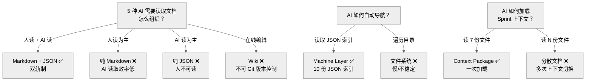

# Decision Tree — Documentation

为什么选择 AI Native 双轨制（Markdown + JSON）而不是 Wiki 或纯 Markdown。

---

## 决策路径

1. 文档同时服务人和 AI → 双轨制，不是二选一
2. Markdown → 人可读可写，Git 友好
3. JSON Machine Layer → AI 快速定位，不需要遍历目录
4. Context Package → AI 一次加载全部 Sprint 上下文，减少来回

## 相关 ADR

- ADR-0010 AI Native

---

> **创建日期:** 2026-06-24
> **最后更新:** 2026-06-24
