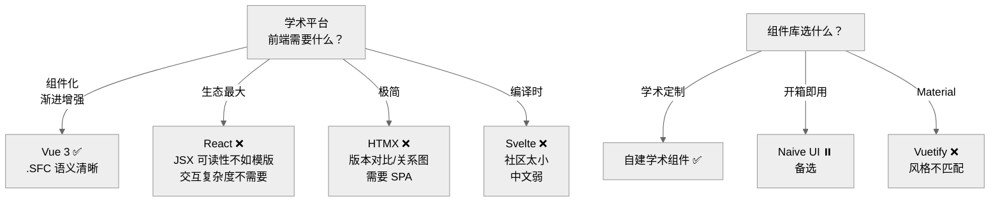

# Decision Tree — Frontend

为什么选择 Vue 3 而不是 React 或 HTMX。

---

## 决策路径

1. 学术平台交互复杂度中等 → 不需要 React 级别的抽象
2. 古籍阅读面板是核心 → 需要 SPA 式的状态管理 → HTMX 不够
3. .vue 单文件组件 AI 可直接解析 → SFC 语义清晰
4. UI 组件库：优先自建学术组件，备选 Naive UI

## 相关 ADR

- ADR-0002 Vue 3

---

> **创建日期:** 2026-06-24
> **最后更新:** 2026-06-24
