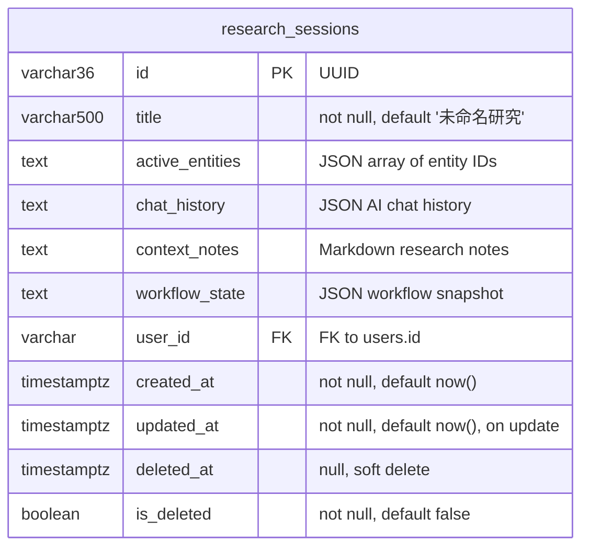

# 2011 — Research Project Domain Mapping Audit

> **Date**: 2026-07-17
> **Status**: Complete
> **Audit Type**: Domain model alignment — frontend ↔ backend

---

## Audit Verdict

**方案 A：ResearchSession 是当前系统唯一的研究聚合根。**

不存在独立 Project 实体、Project 表或 project_id 列。产品层使用"研究课题"一词，但数据库和 API 中只有 `research_sessions` 表。

---

## Domain Model

### Real relationship (source-confirmed)



### Key assertions

1. **There is no `projects` table.** The only research-scoping table is `research_sessions` (`/Users/likeming/Sites/hfb/apps/backend/app/models/workspace.py`).
2. **There is no `project_id` foreign key** anywhere in the schema. Entities reference `session_id` when they need to scope to a research session.
3. **ResearchSession is the aggregate root** for all research-scoped state: entities, chat history, notes, and workflow state all hang off the session.
4. **The product term "研究课题" maps to ResearchSession** — this is a product terminology ↔ engineering entity mapping, not two separate database objects.

---

## Identifier Semantics

| Context         | Identifier                  | Actual meaning              |
| --------------- | --------------------------- | --------------------------- |
| URL route       | `/research/:projectId`      | `ResearchSession.id` (UUID) |
| API response    | `data[].id`                 | `ResearchSession.id` (UUID) |
| Frontend type   | `ResearchProjectSummary.id` | `ResearchSession.id` (UUID) |
| Create request  | POST body                   | → new ResearchSession row   |
| Create response | Response `data.id`          | new ResearchSession.id      |

**The `projectId` route parameter name is a product convenience.** Throughout the system, this value is `ResearchSession.id`. There is no project ID abstraction that differs from the session ID.

---

## API Contract

### GET /api/v1/workspace/sessions

**Source:** `/Users/likeming/Sites/hfb/apps/backend/app/api/v1/ai.py` lines 252–259
**Service:** `WorkspaceService.list_sessions()` in `/Users/likeming/Sites/hfb/apps/backend/app/services/workspace_service.py` lines 42–53

**Request:** No query parameters accepted by the route handler. The service layer has an internal `limit: int = 20` default, but the route handler does NOT pass any params. The `limit=100` the frontend sends is accepted but **not acted upon** — the backend always returns at most 20 sessions.

**Response:**

```json
{
  "success": true,
  "timestamp": "2026-07-17T...",
  "data": [
    {
      "id": "<uuid>",
      "title": "<string>",
      "active_entities": null,
      "context_notes": null,
      "created_at": "2026-07-17T...",
      "updated_at": "2026-07-17T..."
    }
  ],
  "message": "ok"
}
```

**No `total` field.** No pagination metadata.

### POST /api/v1/workspace/sessions

**Source:** `/Users/likeming/Sites/hfb/apps/backend/app/api/v1/ai.py` lines 262–270
**Schema:** `SessionCreateRequest` (line 80–81):

```python
class SessionCreateRequest(BaseModel):
    title: str = "未命名研究"
```

**Request body:**

```json
{ "title": "<string>" }
```

**Response:** Same shape as GET, wrapped in `api_response(data=_session_dict(obj), message="Created")`.

---

## Field Mapping

| Backend field (ResearchSession) | API key            | Frontend field (ResearchProjectSummary) | Optional?                       | Transform                           | Missing handling                         |
| ------------------------------- | ------------------ | --------------------------------------- | ------------------------------- | ----------------------------------- | ---------------------------------------- |
| `id` (UUID varchar)             | `id`               | `id`                                    | Required                        | `String(raw.id \|\| '')`            | Empty string fallback (should not occur) |
| `title` (varchar 500)           | `title`            | `title`                                 | Required                        | `String(raw.title \|\| '')`         | Empty string fallback                    |
| `created_at` (timestamptz)      | `created_at` (ISO) | `created_at`                            | Optional                        | Pass ISO string, null if not string | Null                                     |
| `updated_at` (timestamptz)      | `updated_at` (ISO) | `updated_at`                            | Optional                        | Pass ISO string, null if not string | Null                                     |
| `active_entities` (JSON text)   | `active_entities`  | — not mapped —                          | Internal only                   | Not surfaced to UI                  | —                                        |
| `context_notes` (text)          | `context_notes`    | — not mapped —                          | Internal only                   | Not surfaced to UI                  | —                                        |
| N/A                             | N/A                | `description`                           | **Deleted** (was `null` always) | Not applicable                      | No `description` key added               |
| N/A                             | N/A                | No `status` field                       | **Removed**                     | Not applicable                      | No fake status                           |

### Corrections applied (this audit)

1. **Removed `description: null`** — The old `toProjectSummary` unconditionally set `description: null`. The backend does not provide a description field. The type is now `description?: string | null` (optional), and the mapping function does NOT add this key.
2. **Removed `String()` coercion for dates** — `created_at` and `updated_at` were unconditionally cast to `String()` which turned `null`/`undefined` into `"null"`/`"undefined"`. Now uses `typeof` check to pass the real ISO string or null.
3. **Renamed `ProjectSummary` → `ResearchProjectSummary`** — Makes the ResearchSession origin explicit and eliminates the false impression of a separate `Project` entity.

---

## Search and Pagination

### Real capabilities

| Capability             | Status              | Details                                              |
| ---------------------- | ------------------- | ---------------------------------------------------- |
| Server-side search     | **Not supported**   | No `q`/`search`/`keyword` query param accepted       |
| Server-side pagination | **Not supported**   | No `page`/`page_size`/`offset` params accepted       |
| `total` count          | **Not returned**    | Response has no `total` or pagination metadata       |
| Response size          | **Hardcoded to 20** | `WorkspaceService.list_sessions` defaults `limit=20` |
| Status filtering       | **Not supported**   | ResearchSession has no status column                 |

### Frontend approach

- **Search:** Client-side only, debounced 300ms, filters by title and description on the already-loaded result set.
- **Pagination:** Client-side only, 10 items per page.
- **Total pages:** Computed from the current filtered array length — not a server-provided total.
- **No server params sent** for search or pagination.

---

## Constraints for Following Tasks

All pages in the Research section MUST use `ResearchSession.id` as the single identifier:

| Page            | Route                  | Identifier           | Notes                      |
| --------------- | ---------------------- | -------------------- | -------------------------- |
| Project List    | `/research`            | —                    | Lists ResearchSessions     |
| Project Detail  | `/research/:projectId` | `ResearchSession.id` | projectId === session UUID |
| Workspace       | (contextual)           | `ResearchSession.id` | No separate project        |
| Workflow        | (contextual)           | `ResearchSession.id` | No separate project        |
| Results/Reports | (contextual)           | `ResearchSession.id` | No separate project        |

**Prohibited:**

- Creating an independent `Project` table or model
- Adding a `project_id` column to any table (use `session_id`)
- Treating `ResearchSession` as a "session of a project" — it IS the project
- Using the term "Projects tab" (it's "研究课题列表")
