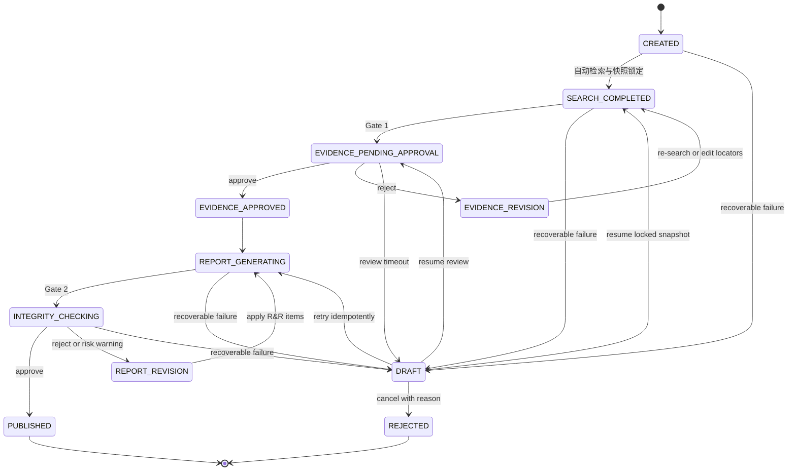

# Academic Research Skills（ARS）对 HFB 的参考评估与架构落地规范

> **文档元数据**
>
> - **状态**：Review Draft（非已批准规范）
> - **更新日期**：2026-07-27
> - **负责人**：HFB 产品与架构负责人（待指定）
> - **关联模块**：[ResearchWorkflowService](/Users/likeming/Sites/hfb/apps/backend/app/services/research_workflow_service.py)
> - **关联架构**：[system-architecture.md](/Users/likeming/Sites/hfb/docs/architecture/system-architecture.md)
> - **批准条件**：关联 RFC/ADR、产品、后端、安全、数据治理的具名批准记录

---

## 1. 结论与架构定位

ARS（Academic Research Skills）最有价值的核心在于其**“把研究过程显式化为可审计工件、不可跳过的完整性关口和人工确认点”**。

- **不照抄**：严禁直接移植 ARS 的提示词编排、13/12/7 Agent 队形或 Markdown 临时工件。它们服务于单篇论文的 Claude Code 命令行交互，而 HFB 是具有企业级 RBAC、持久化研究项目和复杂 UI 的数字人文产品。
- **要吸收**：HFB 已具备更贴近产品的数据基座（检索快照、`trace_id`、`document_id`、Evidence/Citation 引用与 SHA-256 报告哈希），下一步需将这些底层事实提升为**跨步骤契约 (`ResearchPassport`)** 与**可执行发布政策 (Quality Gates)**。

---

## 2. 差异化对标矩阵

| 对标维度     | ARS 做法                                        | HFB 现有现状                                | HFB 升级目标规范                             |
| :----------- | :---------------------------------------------- | :------------------------------------------ | :------------------------------------------- |
| **执行模式** | 多阶段 Agent 命令行轮流调用                     | 同步五步 API 请求                           | 挂起/唤醒式后端异步状态机                    |
| **事实传输** | Markdown 交互文书 (`shared/handoff_schemas.md`) | `InternalTraceRecord` 内存传递              | 版本化 `ResearchPassport` JSON Schema 契约   |
| **质量关口** | 2.5 / 4.5 人工交互确认                          | 报告无阻断直接生成导出                      | 两个强制性 RBAC 产品化关口 (Gate 1 & Gate 2) |
| **权限控制** | 声明式数据分类 (非强制)                         | 对象级权限与 ILIKE 检索；Vector DB 尚未实现 | 动态 RBAC 穿透 + 静态报告归档隔离            |
| **许可证**   | CC BY-NC 4.0                                    | 商业级自主研发代码库                        | 仅吸收设计思想，代码/Prompt 100% 独立实现    |

---

## 3. 工作流状态机与关口设计 (State Machine Specification)

为支撑人工交互关口 (Human-in-the-Loop)，`ResearchRun` 需实现持久化后端状态机。当前 `ResearchRun` 是 `ResearchSession.workflow_state` JSON 中的 run 条目；本规范要求在 P0 先完成独立持久化模型的 ADR、迁移、回填与切换，而不是假定 `research_runs` 表已存在。

### 人工关口定义：

1. **Gate 1 (证据集确认)**：在“检索完成 → 综合生成”之间。呈现候选文献列表、匹配度、摘要与排除原因。研究员可剔除无关文献或补充自定义 Chunk。
2. **Gate 2 (声明完整性确认)**：在“报告生成 → 导出/共享”之间。高亮标记未锚定声明（Unanchored Claims）、低置信度证据（Score < 0.7）及冲突引文，强性阻止不合规导出。
3. **超时与回退机制**：等待期限、提醒渠道和取消权限是待批准的产品策略，不在本文预设为 48 小时。审批超时或可恢复基础设施故障一律进入 `DRAFT`；只能用原锁定快照与幂等任务键恢复。Gate 1 驳回进入 `EVIDENCE_REVISION`，Gate 2 驳回进入 `REPORT_REVISION` 并生成 R&R 问题单。

---

## 4. 可落地路线图与验收标准 (P0 - P3)

### P0：持久化版本化 `ResearchPassport` 契约

- **定义**：为每次 `ResearchRun` 持久化唯一哈希的 Passport。包含：研究问题、检索参数、快照哈希、`trace_id/document_id/chunk_locator` 映射表、许可可见性、生成模型与 Prompt 版本。
- **Schema 结构示例**：包含 `schema_version`（如 `1.0.0`）、`run_id`、`snapshot_hash` 与 `evidence_matrix`。每条 evidence 至少保存 `trace_id`、`document_id`、`chunk_hash`、`start_offset`、`end_offset` 与纳入理由；不得凭空加入当前数据模型不存在的 `tenant_id`。
- **存储方案**：
  - **迁移基线**：当前 runs/manifest 位于 `research_sessions.workflow_state` JSON。ADR 必须定义独立表或等价持久化模型、数据回填、兼容读路径、双写/切换条件及可验证回滚。
  - **索引与元数据**：在 ADR 批准后的独立持久化模型中存储；不得在实施前称为既有 `research_runs` 表。
  - **Payload 详情**：完整的 Snapshot & Trace Matrix 异步存入 Object Storage (OSS/S3)。
- **RBAC 鉴权边界**：
  - **静态导出件**：导出的 PDF/Markdown 定稿文件保持只读归档；
  - **UI 穿透导航**：点击 Citation/Evidence 穿透原文时，实时校验当前用户 RBAC 权限。若已失权，渲染为 `[Access Denied: Restricted Source]` 并阻止高亮显示原文。
- **验收**：任一报告元素均可无缝回溯至确定性源 Chunk；当底层源文件权限被撤销时，UI 穿透响应被拦截。

### P1：引入两个产品化人工关口

- **机制**：由可恢复、幂等的后端异步任务与持久化状态机强制管控，阻断 API 绕过。Celery、Temporal、Redis 或现有基础设施均是 RFC 阶段的候选实现，不构成本文预先批准的技术选型。
- **前端配合**：提供专门的“声明-证据对比面板”与“行内驳回批注”UI 组件。
- **验收**：任何身份均无法通过直接调用 API 绕过 `EVIDENCE_PENDING_APPROVAL` / `INTEGRITY_CHECKING` 进行发布或当前视图导出；所有批准/驳回操作均记录追加式审计日志。任务重试、服务重启与重复回调不得造成重复导出或越级状态转换。

### P2：逐条声明—证据确定性与语义支持审计

- **确定性预检查**：
  1. **防漂移 (Anti-Drift)**：计算目标 Chunk 的 `SHA-256` 及字符偏移量；若变更则标记为 `CHUNK_DRIFTED`；
  2. **存在性与权限**：校验 `document_id` 依然在当前租户库中存在且可读。
- **模型辅助风险信号**：
  - 高影响声明必须全量进行 LLM-as-Judge 语义匹配分析；其余声明采用可记录、可复现的抽样策略；
  - 初始置信度得分 `Score < 0.7` 或检测到逻辑冲突时打上 `RISK_WARNING` / `LOW_CONFIDENCE_CLAIM`，阻断自动发布并打回 Gate 2 标红；该阈值须以人工金标准集校准后才能调整。

### P3：评审与修订闭环 (R&R Matrix)

- 建立轻量级问题单机制 (Revision & Response Matrix)：问题点、严重度等级、关联 Claim/Trace、负责人、修订说明、核验结论。支持多研究员协作与外部同行评审。

---

## 5. 许可合规与系统边界

- **开源许可证隔离**：ARS 源码为 **CC BY-NC 4.0** 许可证。绝对禁止复制其 Prompt 文本、Markdown Schemas 或 Python 脚本至 HFB 商业代码库；实施 Clean Room 原则，仅借鉴其规范思想，由 HFB 团队 100% 自主研发。
- **核心信任根**：HFB 的质量根基在于“真实数据链 (Evidence → Citation → 确凿原文)”，提示词或 Agent 逻辑只能作为辅助分析工具，不得替代后端数据流、RBAC 鉴权或数据库约束。

---

## 6. 批准与下一步

先创建 P0/P1 RFC，至少涵盖 Passport 完整 JSON Schema、状态迁移表、存储迁移与回滚、报告 ACL 与在线穿透 RBAC、审计日志以及浏览器/API 验收用例。仅在具名审批与真实运行验证完成后，本文件才可由 `Review Draft` 升级为已批准规范。
